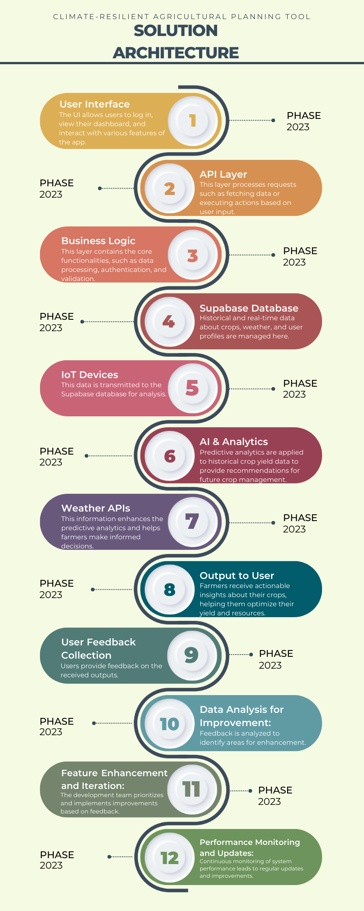

[](https://www.apache.org/licenses/LICENSE-2.0) [](https://developer.ibm.com/callforcode/solutions/projects/get-started/)

# MAKANA-RAINI_UoN

- [Project summary](#project-summary)
  - [The issue we are hoping to solve](#the-issue-we-are-hoping-to-solve)
  - [How our technology solution can help](#how-our-technology-solution-can-help)
  - [Our idea](#our-idea)
- [Technology implementation](#technology-implementation)
  - [IBM watsonx product(s) used](#ibm-ai-services-used)
  - [Other IBM technology used](#other-ibm-technology-used)
  - [Solution architecture](#solution-architecture)
- [Presentation materials](#presentation-materials)
  - [Solution demo video](#solution-demo-video)
  - [Project development roadmap](#project-development-roadmap)
- [Additional details](#additional-details)
  - [How to run the project](#how-to-run-the-project)


## Project summary

### The issue we are hoping to solve

Climate change in Eastern Africa is causing extreme weather variability, leading to unpredictable rainfall and extended droughts. Smallholder farmers, who depend heavily on predictable weather for their crops, struggle to adapt to these changes. This results in reduced crop yields, food insecurity, and economic vulnerability.

### How our technology solution can help

Our AI tool provides climate-resilient farming insights for Eastern African farmers. EEE2062rm/16814

### Our idea

The Climate-Resilient Agricultural Planning Tool is designed to support smallholder farmers in Eastern Africa by offering a predictive, AI-driven platform that combines weather data, soil health analysis, and climate models. The tool integrates data from IBM watsonx.ai, The Weather Company APIs, and other environmental intelligence sources to provide personalized, data-driven recommendations.

Farmers can receive insights on the best planting times, water management strategies, and optimal crop choices based on real-time and historical climate data. The tool analyzes localized weather patterns and soil conditions to offer tailored advice, helping farmers mitigate risks associated with climate variability. This increases the chances of successful harvests, ensuring food security and economic stability.

Our platform is an improvement over existing solutions by focusing on region-specific challenges in Eastern Africa and leveraging the power of AI for smarter agricultural planning. It empowers farmers to plan and adapt to climate change more effectively, promoting sustainability and resilience in agriculture.

## Technology implementation

### IBM watsonx product(s) used

**Featured watsonx products**

- [watsonx.ai](https://www.ibm.com/products/watsonx-ai) - We used watsonx.ai to develop predictive models that analyze weather patterns and soil conditions for Eastern African farms. The AI models recommend optimal planting times, crop choices, and irrigation strategies based on localized climate data. The tool also provides insights on pest risks and crop yield predictions, enhancing decision-making for smallholder farmers.


### Other IBM technology used

**Additional IBM AI services (Remove any that you did not use)**

- [Watson Machine Learning](https://cloud.ibm.com/catalog/services/watson-machine-learning) - Watson Machine Learning was used to train and deploy machine learning models that predict crop yields and soil health. The trained models help farmers in Eastern Africa make informed decisions about crop rotation, soil management, and harvest times based on environmental data and historical records.

- [Watson Studio](https://cloud.ibm.com/catalog/services/watson-studio) - Watson Studio was used for collaborative development, data preprocessing, and model training. Our team utilized Watson Studio’s integrated development environment to analyze agricultural datasets and train our machine learning models in a scalable and efficient way.


### Solution architecture

Diagram and step-by-step description of the flow of our solution:



**Climate-Resilient Agricultural Planning Tool Flow:**
1. **Farmer Interaction with Platform**: The farmer accesses the platform through a mobile app or web portal. They provide input such as crop type, location, soil type, and any specific farming challenges they are facing.

2. **Data Processing via IBM Watsonx AI Services**: The system uses watsonx.ai to analyze farmer inputs along with external data such as weather forecasts, satellite images, and historical agricultural data.

3. **Model Predictions and Recommendations**:
   - Watson Machine Learning generates predictions on optimal planting times, crop yields, and soil health based on the input and data analysis.
   - The system provides recommendations for crop selection, irrigation schedules, and soil enhancement techniques, ensuring climate resilience.

4. **Watsonx for Farmer Queries**:
   - Farmers can ask questions using voice or text in their local language.
   - Watsonx Assistant utilizes Natural Language Understanding to process these inquiries. The system responds with specific agricultural advice based on the data-driven recommendations, presented in the farmer’s preferred language using the Language Translator.

5. **Governance and Compliance**: Watsonx.governance ensures data privacy, regulatory compliance, and auditability of the AI models and predictions, ensuring trustworthiness of the recommendations.

6. **Multilingual Support and Accessibility**: Language Translator enables translation of both input and output, allowing farmers from different regions to interact with the system in Swahili, Amharic, Somali, and other regional languages. Farmers receive the recommendations in their local language, making the platform user-friendly and accessible.

7. **Data Storage and Monitoring**:
   - The platform stores some user data, environmental data, and model predictions securely in the cloud using IBM Object Storage, enabling easy access and future analysis.
   - The system continuously monitors environmental changes and adapts predictions and recommendations based on updated data.

## Presentation materials

### Solution demo video

[](https://youtu.be/vOgCOoy_Bx0)

### Project development roadmap

The project currently does the following things:

- *Feature 1*: Collects and processes farmer inputs, including crop type, location, soil data, and specific farming challenges.
- *Feature 2*: Provides climate-resilient farming recommendations using watsonx.ai, integrating weather data and soil health analysis.
- *Feature 3*: Supports farmer queries in local languages using Watsonx Assistant and Language Translator, allowing for natural language interactions and personalized advice.
- *Feature 4*: Analyzes historical weather patterns and soil conditions to generate predictive insights for optimal planting times and crop choices.
- *Feature 5*: Offers a user-friendly interface for farmers to access insights and recommendations through web and mobile applications.

In the future, we plan to:

- *Add advanced soil health monitoring* using IoT sensors to provide real-time insights into soil conditions, enabling farmers to make informed decisions about soil management and crop health. **[Not yet implemented]**
  
- *Expand language support* to additional regional languages in Eastern Africa, ensuring that our platform is accessible to a broader audience and can cater to the diverse linguistic needs of farmers. **[Not yet implemented]**
  
- *Integrate real-time market price data* to offer crop profitability insights, helping farmers make better decisions regarding crop selection and sales strategies based on current market trends. **[Not yet implemented]**
  
- *Enhance data governance features* with further capabilities from watsonx.governance to ensure compliance with regional regulatory requirements and to maintain transparency and accountability in data handling. **[Not yet implemented]**
  
- *Implement user education and training programs* to help farmers understand how to effectively use the platform and leverage its features for better agricultural practices. **[Not yet implemented]**
  
- *Develop a community engagement platform* to foster collaboration among farmers, allowing them to share experiences, tips, and best practices, thereby enhancing the overall user experience. **[Not yet implemented]**
  
- *Introduce predictive analytics for pest and disease management* to provide farmers with timely alerts and recommendations based on environmental conditions and historical data. **[Not yet implemented]**
  
- *Launch a mobile application version* of the platform to increase accessibility and usability for farmers in remote areas, ensuring they can access insights and recommendations on-the-go. **[Not yet implemented]**

### Future Implementation Roadmap (January Onwards)

Starting in January, we will focus on a structured roadmap to enhance our platform and better serve our users. The key initiatives include:

1. **January - Multilingual Support Expansion**: We will expand language support to additional regional languages, ensuring accessibility for a diverse audience of farmers.

2. **February - Real-Time Market Price Integration**: We aim to integrate real-time market price data, providing farmers with insights that will help them make informed decisions about crop selection and sales strategies.

3. **March - User Education and Training**: We will implement user education and training programs to empower farmers to effectively utilize the platform and its features.

4. **April - Performance Optimization**: Our focus will shift to optimizing application performance, ensuring a smooth and responsive user experience.

5. **May - Community Engagement and Partnerships**: We will develop a community engagement platform to foster collaboration among farmers and explore partnerships with agricultural organizations.

6. **June - Advanced Soil Health Monitoring**: We plan to integrate IoT sensors for real-time soil health monitoring, providing actionable insights for farmers.

7. **July - Enhanced Data Visualization**: We will improve data visualization features to present insights more clearly and effectively.

8. **August - Predictive Analytics for Pest and Disease Management**: We will introduce predictive analytics to help farmers manage pests and diseases proactively.

This roadmap outlines our commitment to continuous improvement and innovation, ensuring that our platform remains a valuable resource for farmers in Eastern Africa.

## Additional details

### How to run the project

To run the project locally for development and testing, follow these steps:

1. **Clone the Repository:**
   ```bash
   git clone https://github.com/makanaraini/Climate-Resilient-Agricultural-Planning-Tool---CFC-2024.git
   ```

2. **Navigate to the Project Directory:**
   ```bash
   cd Climate-Resilient-Agricultural-Planning-Tool---CFC-2024
   ```

3. **Install Dependencies:**
   Make sure you have Node.js and Python installed. Install necessary dependencies using:
   ```bash
   npm install
   pip install -r requirements.txt
   ```

4. **Set Up Environment Variables:**
   Create a `.env` file in the root directory and add the required environment variables (e.g., API keys, database URLs). **[Ensure this is completed]**

5. **Run the Application:**
   - For the backend:
     ```bash
     python app.py
     ```
   - For the frontend:
     ```bash
     npm start
     ```

6. **Access the Application:**
   Open your web browser and go to `http://localhost:3000` to view the application.

